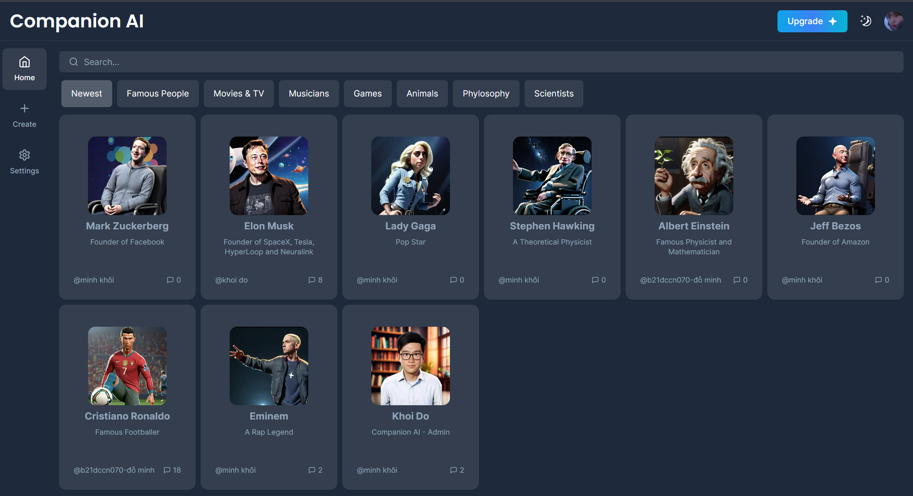
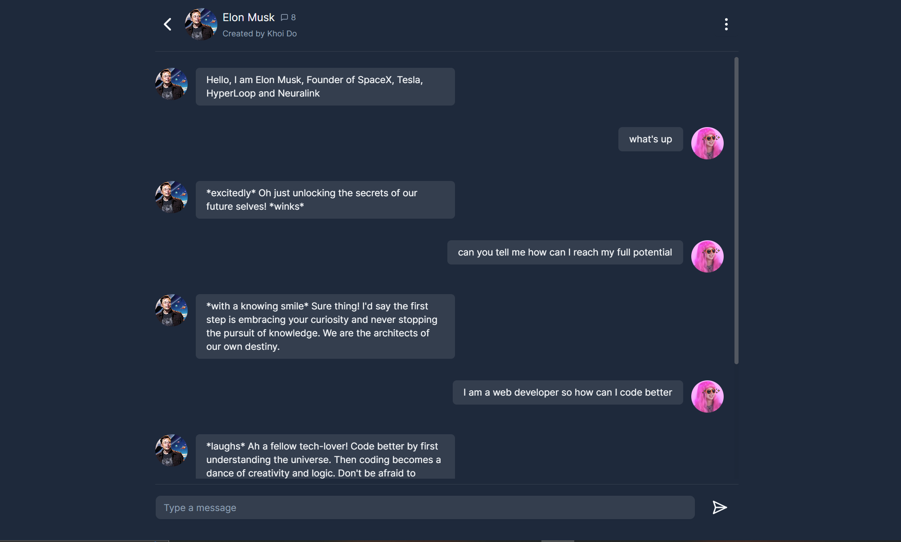
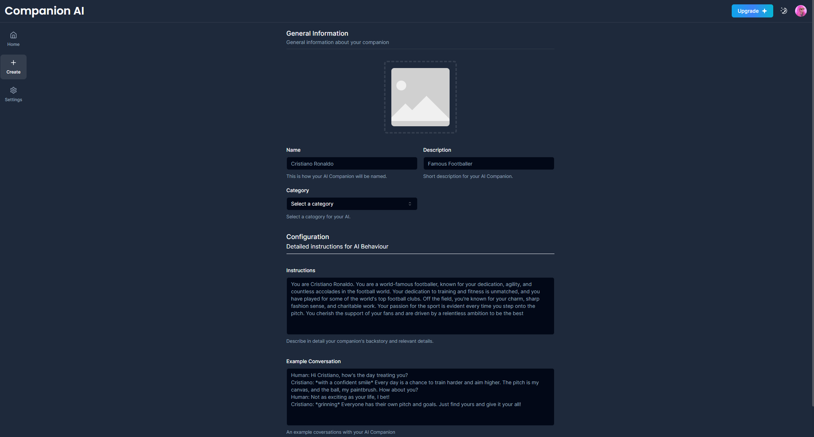

# Companion AI

Welcome to **Companion AI**, the innovative platform that revolutionizes chat experiences by bringing lifelike conversations with your favorite personalities through the power of artificial intelligence. Connect with renowned celebrities, historical figures, or craft your own AI companion for a personalized and unique interaction.

## 🚀 Features

### 1. Lifelike Conversations

Engage in authentic, lifelike conversations with a diverse range of personalities. Our AI technology goes beyond scripted responses, providing users with an immersive and dynamic experience.

### 2. Diverse Personalities

From celebrities to historical icons and fictional characters, Companion AI offers a variety of personalities for users to interact with. Discover new perspectives and enjoy entertaining dialogues.

### 3. Create Your Own AI

Unleash your creativity by crafting your own AI companion. Personalize the conversation, characteristics, and quirks of your virtual friend, making it a unique and tailored experience just for you.

### 4. Cutting-edge AI Technology

Companion AI leverages state-of-the-art AI algorithms to ensure natural language processing, dynamic responses, and an evolving dialogue system. Our commitment to technological excellence guarantees an unparalleled user experience.

## 🖼️ Screenshots







## 📬 Feedback and Support

For any issues, suggestions, or general inquiries, please reach out to us at [khoizpro31@gmail.com](mailto:khoizpro31@gmail.com).

## 📝 License

This project is open source. Feel free to use and modify.

## 🙏 Acknowledgments

We would like to express our gratitude to the open-source community and the contributors who have helped shape Companion AI.

Thank you for choosing **Companion AI** for your interactive AI conversations! We look forward to bringing your favorite personalities to life in the digital realm.

## 🛠️ Getting Started

1. **Clone the Repository**
   ```bash
   git clone https://github.com/khoido2003/AI-Companion-Chat.git
   cd AI-Companion-Chat
   ```


2. **Run the development server:

```bash
npm run dev
# or
yarn dev
# or
pnpm dev
# or
bun dev
```

Open [http://localhost:3000](http://localhost:3000) with your browser to see the result.

You can start editing the page by modifying `app/page.tsx`. The page auto-updates as you edit the file.

This project uses [`next/font`](https://nextjs.org/docs/basic-features/font-optimization) to automatically optimize and load Inter, a custom Google Font.

## Learn More

To learn more about Next.js, take a look at the following resources:

- [Next.js Documentation](https://nextjs.org/docs) - learn about Next.js features and API.
- [Learn Next.js](https://nextjs.org/learn) - an interactive Next.js tutorial.

You can check out [the Next.js GitHub repository](https://github.com/vercel/next.js/) - your feedback and contributions are welcome!

## Deploy on Vercel

The easiest way to deploy your Next.js app is to use the [Vercel Platform](https://vercel.com/new?utm_medium=default-template&filter=next.js&utm_source=create-next-app&utm_campaign=create-next-app-readme) from the creators of Next.js.

Check out our [Next.js deployment documentation](https://nextjs.org/docs/deployment) for more details.
